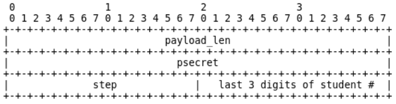
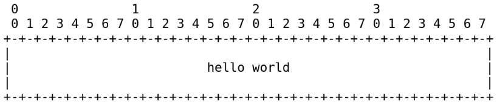
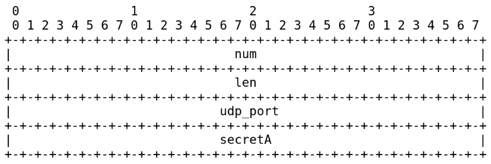
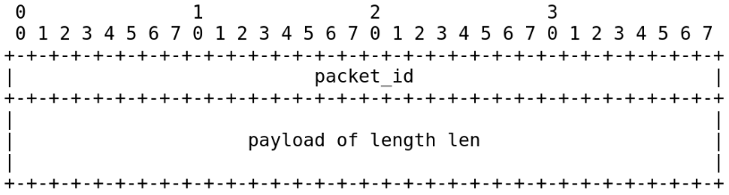
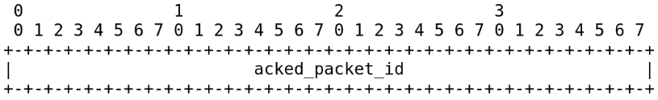
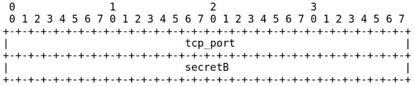
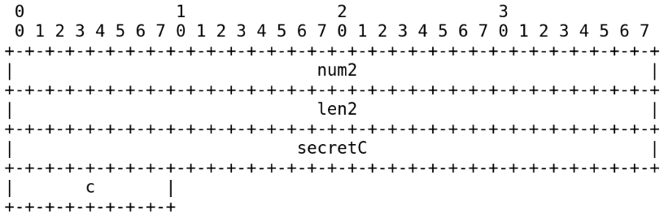
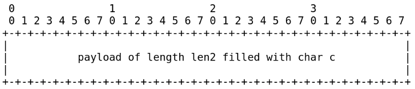
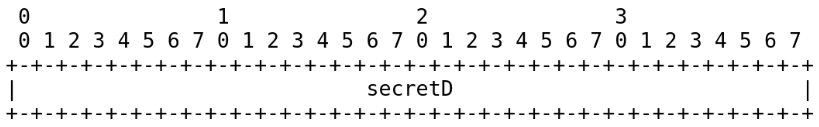

# Resposta
Para solucionar esse problema foi utilizado um container com Docker, ao invés da máquina virtual comum recomendada para o trabalho.

Estado: 
- [x] A
- [x] B
- [x] C
- [x] D
## Como executar a solução usando o Docker
Dentro da pasta principal caso seja a primeira vez que irá executar
- docker-compose up -d

Dentro da pasta principal caso já tenha executado o comando a cima pelo menos uma vez
- docker-compose start

Execute o container de forma iterativa
- docker exec -it [nome do container gerado] Ssh.

Depois bastar seguir os passos indicados na descrição do trabalho:
- gere os binários (make);
# Trabalho 2: Mais sobre programação básica com sockets.

## Prefácio

Você deve programar o trabalho em Golang.

A trabalho pode ser realizado individualmente ou em dupla.

A cópia do trabalho não deveria ser uma prática. A discussão é saudável.

## Protocolo
Você criará um cliente que se comunicará com um servidor segundo o
protocolo anterior. A tarefa do servidor é validar que o cliente está seguindo o protocolo.
Qualquer desvio que o cliente fizer, do protocolo estabelecido, o servidor fechará a conexão. O
cliente e o servidor comunicar-se-ão via sockets UDP e TCP. A seguir a descrição do protocolo,
em estágios. O servidor deve ter a habilidade de comunicar-se com mais de um cliente ao mesmo tempo.
Lembre-se, o protocolo deve ser seguido à risca.

O servidor escutará por pacotes UDP na porta 12235. O servidor espera receber e irá enviar
somente:

- Pacotes com o cabeçalho abaixo.
- Dados com bytes em ordem da rede (big-endian).
- Inteiros sem sinal de 4 bytes ou de 2 bytes.
- Caracteres.
- Strings, que são sequências de caracteres finalizando com caractere ’\0’.
- Pacotes devem ser preenchidos até o comprimento ser divisível por 4.

O servidor fechará qualquer socket aberto com um cliente se:

- Número inesperado de pacotes foi recebido.
- Comprimento do pacote ou dos dados inesperado.
- O servidor não receber qualquer pacote do cliente em 3 segundos.
- O servidor não recebe o segredo correto.

Cada dado, enviado por TCP ou UDP, ao/do servidor deve ter o cabeçalho. Este cabeçalho
deve estar prefixado aos dados. O cabeçalho tem comprimento, constante, de 12 bytes.

Os  primeiros 4 bytes do cabeçalho contém o comprimento dos dados que o pacote carrega. Os
próximos 4 bytes contém o segredo de estágio prévio do protocolo. Os próximos dois bytes
contém um inteiro indicativo do estágio corrente do protocolo. Para o lado cliente, o campo **step** sempre será
o número 1, para o servidor será 2. Para o **estágio A**, psecret é definido 0. Para os estágios posteriores psecret usa o valor
informado pelo servidor na resposta que é passo anterior. Os últimos dois bytes do cabeçalho deve ser preenchido com um inteiro formado pelos últimos 3 números da
matrícula de um aluno. 

## Estados do protocolo
O cabeçalho é omitido nos pacotes seguintes, para eliminar redundância, mas lembre-se:
**todo pacote tem o cabeçalho acima**.

### ESTADO A
#### Passo A1 - CLIENTE - REQUISIÇÃO
O cliente envia um único pacote UDP contendo a string "hello world", sem as aspas, para o
servidor que estará escutando em 12235.

#### Passo A2 - SERVIDOR - RESPOSTA
O servidor responde com um pacote UDP contendo quatro inteiros: num, len, udp_port, secretA:

### ESTADO B
#### Passo B1 - CLIENTE - REQUISIÇÃO
O cliente envia **num** pacotes UDP para o servidor que escuta a porta **udp_port**. Cada um desses pacotes
de dados tem comprimento **len**. O campo **psecret** dos pacotes deve conter o valor informado em **secretA**.

Os primeiros 4 bytes de dados de cada pacote deve ser um inteiro identificando o pacote.
O primeiro pacote deve ter esse inteiro definido como 0 e o último pacote deve ter esse
inteiro definido como −1. O restante dos bytes no pacote(len), devem ser 0s.

Para cada pacote de dados recebido pelo servidor, ele irá responder com um
pacote “ack” que contém como dado o identificador do pacote reconhecido. O cliente envia
o próximo pacote somente após a confirmação do anterior.

Para completar este passo, o cliente deve receber todos pacotes ack do servidor para todos num
pacotes gerados. Para isso, o cliente deve reenviar todo pacote que o servidor não reconheceu
com ACKs. O cliente deve usar um intervalo de retransmissão de meio segundo.

#### Passo B2 - SERVIDOR - RESPOSTA

Para cada pacote de dados recebido, o servidor decide aleatoriamente se confirma
aquele pacote respondendo com um pacote “ack” que contém como dado o identificador do
pacote reconhecido:

O servidor deve receber o mesmo pacote novamente se decidir não enviar uma confirmação
(certifique-se de que seu servidor não envie um ack pelo menos uma vez para toda a transação).

Desde que o servidor recebe todos os num pacotes, ele envia um pacote UDP contendo dois
inteiros: um número de porta TCP e secretB.

Agora o servidor deve esperar por uma conexão TCP do cliente no número da porta TCP.

### ESTADO C
#### Passo C1 - CLIENTE - REQUISIÇÃO
O cliente abre uma conexão TCP com o servidor na porta tcp_port recebida do servidor no
passo b2.
#### Passo C2 - SERVIDOR - RESPOSTA
O servidor envia 3 inteiros: num2, len2, secretC e um caractere, c, escolhido de forma aleatória no 
alfabeto.

### ESTADO D
#### Passo D1 - CLIENTE - REQUISIÇÃO
O cliente envia num2 pacotes, cada com dados de comprimento len2, com todos os bytes definidos
como o caractere informado pelo servidor no pacote enviado no passo c2.

#### Passo D2 - SERVIDOR - RESPOSTA
O servidor responde com um inteiro: secretD.

## Considerações finais

Você deve criar um arquivo **.zip**, não é **.rar** ou qualquer outra foram de compactação, contendo:
- Código cliente.
- Código servidor.
- TXT com nome e matrícula da equipe.
- Link para vídeo explicando:
    - Os códigos, a execução da comunicação do servicor com 
      um cliente e outra execução com o servidor comunicando-se 
      paralelamente com dois clientes.
    
Submeta no sigaa até o prazo de entrega. Caso as explicações e execução não fiquem claras,
haverá requisição de apresentação ao professor.